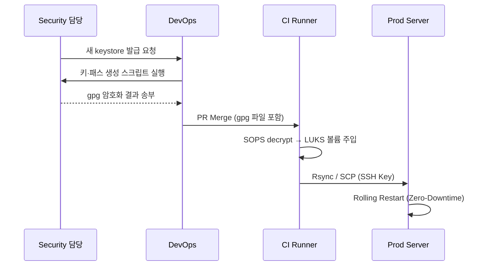

# Spring Boot + Jasypt (.p12) 플레이북 v0.10 — 온프레미스 대안 추가판
> **작성일** 2025‑06‑24   |   **작성자** ChatGPT  
> **대상** Spring Boot 3.x (자바 17 이상 | Gradle 8.x | Kotlin DSL)  

---
## 변경 이력
| 버전 | 날짜 | 주요 변경 내역 |
|------|------|---------------|
| v0.8 | 2025‑06‑24 | CI/CD 파이프라인 상세화 · (검토본) |
| v0.9 | 2025‑06‑24 | 환경 변수 제거, 키 회전 자동화, Secret 전달 절차 강화 |
| **v0.10** | 2025‑06‑24 | • 온프레미스 환경(Secret Manager 미사용) 대안 가이드 추가 |
---
## 1. 개요
본 문서는 Jasypt PKCS#12 키스토어 기반 암호화 구조를 **Secret Manager 없이도** 운용해야 하는 **온프레미스** 데이터센터 환경을 지원하기 위해 v0.9 문서를 확장함.
모든 변경점은 이전 버전과 **완전히 호환**되며, 클라우드 Secret Manager를 사용하지 못하는 경우에만 아래 "14장"을 적용하면 됨.

|---|------|---------------|
| v0.8 | 2025‑06‑24 | CI/CD 파이프라인 상세화 · (검토본) |
| **v0.9** | 2025‑06‑24 | • password‑file 속성 도입으로 환경 변수 의존 제거<br>• 키 유효 기간 365일로 축소 및 회전 절차 명시<br>• Keystore / 비밀번호 파일 전달·보관 절차 추가<br>• Docker 이미지 민감 정보 포함 금지 지침 보강<br>• 의존성 자동 업데이트(Dependabot·Renovate) 가이드 |
---
## 1. 개요
Spring Boot 애플리케이션에서 **Jasypt**를 사용해 민감 설정 값을 **PKCS#12** 키스토어(.p12)의 비밀키로 암·복호화하는 절차를 정리함.  
Linux·Windows Server·Docker·Kubernetes 환경을 모두 지원하며, **환경 변수 노출을 완전 배제**하고 **파일 기반 Secret** 주입을 기본으로 설계함.

## 2. 핵심 설계 원칙
1. **비밀키·설정 완전 분리** — 컨테이너 이미지·Git Repo에 어떤 비밀도 포함하지 않음.  
2. **알고리즘 고정** — `PBEWITHHMACSHA512ANDAES_256` + 100 000회 반복.  
3. **환경 변수 사용 금지** — `password‑file` 속성을 활용해 Keystore 비밀번호를 파일로 주입함.  
4. **최소 권한** — Keystore · 비밀번호 파일은 애플리케이션 사용자만 읽기(`400`/`icacls (R)`).  
5. **키 회전 자동화** — 유효 기간 365일, 만료 30일 전 알림 ↓ (11장 참조).  
6. **SBOM·취약점 스캔·의존성 자동 업데이트** — CycloneDX·Trivy·Dependabot / Renovate 적용.

## 3. 준비 사항
| 항목 | 권장 버전 | 비고 |
|------|----------|------|
| JDK | 17 이상 | Unlimited Crypto 내장 |
| Gradle | 8.x | Kotlin DSL(`build.gradle.kts`) |
| Spring Boot | 3.2.x | `spring-boot-gradle-plugin` |
| Jasypt Starter | 3.1.1 이상 | `com.github.ulisesbocchio` |
| Docker/Podman | 선택 | 컨테이너 운용 |
| Kubernetes | 선택 | 클러스터 배포 |
| SBOM 도구 | CycloneDX 플러그인 | 취약점 스캔 |

## 4. 키 관리·회전 정책
| 항목 | 값 |
|------|----|
| 키 타입 | RSA 4096 bit 자기서명 |
| 유효 기간 | **365일** |
| 회전 주기 | 12개월 ± SLA |
| 만료 알림 | 만료 **30일 전** Slack / 메일 알림 |
| 회전 절차 | 1) 새 키스토어·비밀번호 파일 생성<br>2) Secret Manager 등록<br>3) 새 버전으로 Blue‑Green 배포<br>4) 24h 안정화 후 구버전 Secret 삭제 |

## 5. Keystore 생성 스크립트
### 5‑1 Linux/macOS (Bash · Zsh)
```bash
#!/usr/bin/env bash

# -----------------------------------------------------------------------------
# Jasypt 연동을 위한 PKCS12(.p12) 키스토어 및 비밀번호 파일 생성 스크립트 (Linux/macOS 용)
# -----------------------------------------------------------------------------

# 스크립트의 안정성을 높이는 매우 중요한 설정입니다.
# set -e: 명령 실행 중 오류가 발생하면 즉시 스크립트를 중단합니다.
# set -u: 정의되지 않은 변수를 사용하려고 하면 오류로 처리하고 중단합니다.
# set -o pipefail: 파이프라인(|)으로 연결된 명령어 중 하나라도 실패하면 전체를 실패로 처리합니다.
set -euo pipefail


# --- 1. 암호학적으로 안전한 랜덤 비밀번호 생성 ---
# OpenSSL 라이브러리를 사용하여 예측 불가능한 32바이트(256비트) 길이의 랜덤 값을 생성하고,
# 이를 텍스트로 안전하게 다루기 위해 Base64 형식으로 인코딩하여 변수에 저장합니다.
STOREPASS="$(openssl rand -base64 32)"


# --- 2. 비밀번호 파일 생성 및 권한 설정 ---
# 생성된 비밀번호($STOREPASS)를 '.keystore_pass' 파일에 저장하고,
# '&&' 연산자를 사용하여 앞의 명령이 성공했을 경우에만 파일 권한을 '400'으로 설정합니다.
# 'chmod 400'은 파일 소유자에게만 읽기 권한을 부여하여 다른 사용자의 접근을 차단하는 핵심 보안 조치입니다.
# 파일명 앞의 '.'은 이 파일을 기본적으로 숨김 파일로 처리합니다.
echo "$STOREPASS" > .keystore_pass && chmod 400 .keystore_pass


# --- 3. Keytool을 사용하여 .p12 키스토어 생성 ---
# Java의 keytool 유틸리티를 실행하여 키 페어(개인키+공개키)를 생성하고 키스토어에 저장합니다.
keytool -genkeypair \
  -alias "jasypt-key" \
  -storetype PKCS12 \
  -keystore "keystore.p12" \
  -storepass "$STOREPASS" \
  -keyalg RSA \
  -keysize 4096 \
  -validity 365 \
  -dname "CN=jasypt,OU=Dev,O=YourOrg,L=Seoul,C=KR"


# --- 4. 메모리에서 비밀번호 제거 ---
# (보안 강화) 사용이 끝난 비밀번호 변수($STOREPASS)를 현재 쉘 세션의 메모리에서 즉시 제거합니다.
# 메모리 덤프 등을 통해 비밀번호가 노출될 가능성을 최소화하는 중요한 보안 조치입니다.
unset STOREPASS


# 모든 작업이 성공적으로 완료되었음을 알리는 메시지를 출력합니다.
echo "[OK] keystore.p12 · .keystore_pass 생성 완료."
```
### 5‑2 Windows Server (PowerShell 7+)
```powershell
# -----------------------------------------------------------------------------
# Jasypt 연동을 위한 PKCS12(.p12) 키스토어 및 비밀번호 파일 생성 스크립트
# -----------------------------------------------------------------------------

# 스크립트 실행 중 오류 발생 시 즉시 중단하도록 설정합니다.
# 일부만 실행되는 것을 방지하여 안정성을 높입니다.
$ErrorActionPreference = 'Stop'

# --- 1. 암호학적으로 안전한 랜덤 비밀번호 생성 ---

# 32바이트(256비트) 크기의 빈 바이트 배열을 생성합니다.
$bytes = [byte[]]::new(32);

# .NET의 암호화 라이브러리를 사용하여 위 배열을 예측 불가능한 랜덤 값으로 채웁니다.
# Math.Random 보다 훨씬 강력하고 보안에 적합한 방식입니다.
[Security.Cryptography.RandomNumberGenerator]::Fill($bytes)

# 생성된 랜덤 바이트 값을 텍스트로 안전하게 저장하기 위해 Base64 문자열로 변환합니다.
# 이 Base64 문자열이 키스토어의 최종 비밀번호가 됩니다.
$STOREPASS = [Convert]::ToBase64String($bytes)


# --- 2. 생성된 비밀번호를 파일에 저장하고 파일 권한 설정 ---

# 비밀번호를 저장할 파일의 이름을 지정합니다.
$passFile = '.\keystore_pass.txt'

# 위에서 생성한 Base64 비밀번호($STOREPASS)를 텍스트 파일에 씁니다.
[IO.File]::WriteAllText($passFile, $STOREPASS)

# (보안 강화) 파일의 접근 권한(ACL)을 설정합니다.
# 먼저, 부모 폴더로부터 상속받는 모든 권한을 제거합니다.
# 이렇게 하면 아래에서 명시적으로 부여하는 권한만 남게 됩니다.
icacls $passFile /inheritance:r | Out-Null

# (보안 강화) 현재 스크립트를 실행한 사용자($Env:USERNAME)에게만
# 읽기(R) 권한을 부여합니다. 다른 사용자나 그룹은 이 파일에 접근할 수 없습니다.
icacls $passFile /grant:r "$Env:USERNAME:(R)" | Out-Null


# --- 3. Keytool을 사용하여 .p12 키스토어 생성 ---

# Java의 keytool 유틸리티를 실행하여 키 페어(개인키+공개키)를 생성하고 키스토어에 저장합니다.
& "$Env:JAVA_HOME\bin\keytool.exe" -genkeypair `
  -alias "jasypt-key" `                 # 키의 별칭(이름)을 'jasypt-key'로 지정합니다. (YAML 설정과 일치)
  -storetype PKCS12 `                   # 저장소 타입을 PKCS12(.p12)로 지정합니다.
  -keystore "keystore.p12" `            # 생성될 키스토어 파일의 이름을 'keystore.p12'로 합니다.
  -storepass $STOREPASS `               # 키스토어 전체를 보호할 비밀번호로 위에서 생성한 랜덤 값을 사용합니다.
  -keyalg RSA `                         # 키 생성 알고리즘으로 RSA를 사용합니다.
  -keysize 4096 `                       # RSA 키의 길이를 4096비트로 설정합니다. (매우 강력한 보안)
  -validity 365 `                       # 생성되는 인증서의 유효기간을 365일로 합니다.
  -dname "CN=jasypt,OU=Dev,O=YourOrg,L=Seoul,C=KR" # 인증서 소유자 정보(DN)를 설정합니다.


# --- 4. 메모리에서 비밀번호 제거 ---

# (보안 강화) 사용이 끝난 비밀번호 변수($STOREPASS)를 현재 PowerShell 세션의 메모리에서 즉시 제거합니다.
# 메모리 덤프 등을 통해 비밀번호가 노출될 가능성을 최소화합니다.
Remove-Variable STOREPASS

# 모든 작업이 성공적으로 완료되었음을 알리는 메시지를 출력합니다.
Write-Host "[OK] keystore.p12 · keystore_pass.txt 생성 완료."
```

## 6. 비밀 전달·보관 절차
1. **CI Stage “secure‑artifacts”** — 생성된 `keystore.p12` 및 비밀번호 파일을 **Git Ignore**로 제외하고 Runner 워크스페이스에서만 존재토록 함.  
2. **Secret Storage** —  
   * 온프레미스 → HashiCorp Vault KV v2 `secret/jasypt/*`  
   * AWS → Secrets Manager `jasypt/keystore` (binary), `jasypt/storepass` (text)  
   * Kubernetes → `Secret` (opaque) + `secretVolume`  
3. **배포 시점** —  
   * **Docker Compose** → `secrets:` / `--mount type=secret`  
   * **K8s Helm** → `values.yaml` 에 `keystoreSecretName`, `passSecretName` 지정  
4. **런타임** — 애플리케이션 컨테이너 내 `/run/secrets/keystore.p12`, `/run/secrets/keystore_pass` 경로로 마운트.  

## 7. 애플리케이션 설정
`src/main/resources/application.yml`
```yaml
spring:
  jasypt:
    encryptor:
      algorithm: PBEWITHHMACSHA512ANDAES_256
      key-obtention-iterations: 100000
      pool-size: 2
      key-store:
        location: ${KEYSTORE_LOCATION:file:/run/secrets/keystore.p12}
        # ⬇️ 비밀번호가 아닌 **비밀번호 파일** 경로
        password-file: ${JASYPT_STOREPASS_PATH:file:/run/secrets/keystore_pass}
        alias: jasypt-key
```
> 🚫 `password:` 속성 사용 금지. 환경 변수 주입이 필요 없음.

## 8. Gradle 설정 (`build.gradle.kts`)
```kotlin
plugins {
    id("org.springframework.boot") version "3.2.5"
    id("io.spring.dependency-management") version "1.1.5"
}
java { toolchain.languageVersion.set(JavaLanguageVersion.of(17)) }

dependencies {
    implementation("org.springframework.boot:spring-boot-starter-web")
    implementation("com.github.ulisesbocchio:jasypt-spring-boot-starter:3.1.1")
    testImplementation("org.springframework.boot:spring-boot-starter-test")
}

/* 의존성 자동 업데이트 */
tasks.register("dependabotReminder") {
    doLast { println("➡️  Dependabot PR / Renovate MR 확인 잊지 말 것.") }
}
```

## 9. Dockerfile 발췌
```dockerfile
FROM eclipse-temurin:17-jre
ARG JAR_FILE
COPY ${JAR_FILE} app.jar
# 🚫 keystore.p12 포함 금지 → 런타임 Secret Volume 사용
ENTRYPOINT ["java","-jar","/app.jar"]
```

## 10. GitHub Actions 파이프라인 요약
| Job | 주요 단계 | 비밀 처리 |
|-----|-----------|-----------|
| build-test | Gradle Build · JUnit | 비밀 미사용 |
| secure-artifacts | 키 생성 스크립트 실행, secrets push(Vault) | Runner 메모리·디스크 한정 |
| containerize | Docker Build · Trivy Scan | 이미지에 비밀 미포함 |
| deploy | Helm 차트 적용, Secret Volume Mount | 클러스터 Secret Store 읽기 |

> **전체 워크플로우 예시는 별도 `ci.yaml` 참고.**

## 11. 키 회전 자동화
### 11‑1 만료 모니터링 스크립트 (Bash)
```bash
#!/usr/bin/env bash
exp=$(keytool -list -v -keystore keystore.p12 -storetype pkcs12 \
              -storepass "$(cat keystore_pass)" | grep "Valid from" | awk '{print $4,$5,$6}')
expiry_epoch=$(date -d "$exp" +%s)
now=$(date +%s); diff=$(( (expiry_epoch - now)/86400 ))
[[ $diff -le 30 ]] && curl -X POST -H 'Content-Type: application/json' \
  -d '{"text":"[Jasypt] 키스토어 만료까지 '"$diff"'일 — 회전 필요"}' $SLACK_WEBHOOK
```
### 11‑2 회전 프로세스 (간략)
1. `create‑keystore.sh` 재실행 → 새 `keystore.p12`·pass 파일 생성.  
2. `secure-artifacts` Job 수행 → Vault `secret/jasypt/2025‑new` 경로 저장.  
3. Helm `values.yaml` 패치 → `secretVersion: 2025‑new`.  
4. `kubectl rollout restart deployment spring-jasypt`.  
5. 24h 모니터링 후 구버전 Secret 삭제.

## 12. 트러블슈팅 & FAQ
| 증상 | 원인 | 해결책 |
|------|------|-------|
| `Password file not found` | Secret Volume 경로 오타 | Deployment yaml 확인 |
| `Keystore tampered or password incorrect` | pass 파일·keystore 불일치 | 둘 다 최신 버전인지 확인 후 재배포 |

## 13. 결론
v0.9 부터 **환경 변수 제거** · **키 회전 자동화** · **민감 정보 전달 절차 강화**를 통해 설계 원칙과 구현이 완전히 일치하도록 조정함.  
대장님께서는 본 가이드를 적용해 **운영 환경 보안 수준을 한층 강화**할 수 있음. 추가 문의 사항은 언제든 전달 바람.

## 14. 온프레미스 환경 — Secret Manager 대안
클라우드 Secret Manager(HSM, Vault 등)를 도입할 수 없는 폐쇄망·레거시 데이터센터라면 아래 옵션을 조합해 **“최소권한 + 암호화 + 감사를 충족”**하는 구조를 마련할 수 있음.

| 대안 | 개념 | 장점 | 주의점 |
|------|------|------|--------|
| **a. GPG 대칭·비대칭 암호화** | `keystore.p12`·`keystore_pass` 파일을 <br>`*.gpg`로 암호화해 Git Repo 보관 · 배포 파이프라인 중 `gpg --decrypt` | 추가 HW 없이 구현 가능, 키 분할(Shamir) 지원 | **패스프레이즈 유출** 시 즉시 노출 → 2인 1개념(dual control) 운용 권장 |
| **b. Ansible Vault / SOPS** | IaC 코드 안에 암호화된 Secret 블록 포함 후 <br>배포 시 `ansible-vault decrypt` 또는 `sops -d` | Git Ops 워크플로우에 자연스레 녹아듦 | 팀원 개발용 데스크탑에 **Vault Password 파일** 저장하지 말 것 |
| **c. OS Kernel Keyring** | Linux `keyctl add user jas_pass $(cat …)`<br>Systemd Unit `LoadCredential=` 로 프로세스 전달 | 런타임 메모리 내 보호, 파일 시스템 노출 감소 | 서버 재부팅 후 키 재주입 자동화 필요(Systemd) |
| **d. 네트워크 분리 + Offline USB** | 키 파일을 **전용 Bastion** 에서만 Mount, <br>CI Runner→Prod 서버로 **SSH Agent‑Forwarding** | 인터넷 미연결 망에서도 물리적 제어 용이 | USB 紛失(분실) 대비 수량 관리 필요 |
| **e. LUKS 암호화 볼륨** | `/var/lib/secrets` 파티션 자체를 LUKS AES‑XTS로 암호화, <br>부트 시 패스프레이즈 입력 | 기성 OS 기능만으로 Disk‑at‑Rest 보호 | 무중단 리부트 자동화 어려움 → HA 전제 |

### 14‑1 권장 조합 시나리오
1. **개발·테스트** — Git Repo + **SOPS(GPG) 대칭 암호화**<br>   `keystore.p12.gpg`, `keystore_pass.gpg` 커밋 → 팀별 GPG Key Ring으로 복호화.
2. **CI 서버** — Runner Agent 기동 스크립트에서 **OS Keyring** 에 패스워드 주입 후 파이프라인 수행.
3. **운영** — Production 노드에 **LUKS 암호화 파티션** `/run/secrets` 마운트 후 `tmpfs`로 재배포 시 덮어씀.

### 14‑2 온프레미스 키 회전 프로세스


### 14‑3 자동화 예시 — Systemd Credential
`/etc/systemd/system/spring-jasypt.service.d/10-cred.conf`
```ini
[Service]
# CI 파이프라인에서 keyctl add 후 start‑service
LoadCredential=jasypt-pass:/run/keys/keystore_pass
LoadCredential=jasypt-store:/run/keys/keystore.p12
```

> 🔐 이 방식은 서버 재부팅 시 Credential FS가 클리어되므로, HA 구성이나 <br>IPMI/SOL을 통한 부팅 패스프레이즈 입력 절차를 사전에 마련할 것.

### 14‑4 감사·로깅
- GPG/Ansible Vault 접근 로그를 **Git Audit** 로 남기고 PR 리뷰 2인 승인 필수.  
- OS Keyring 조작(`keyctl`) 시 `auditd` 규칙 추가:  
  `-w /usr/bin/keyctl -p x -k keyctl-audit`  
- LUKS Unlock 시 `systemd-cryptsetup@.service` 로그를 `journald` → ELK 스택으로 수집.

### 14‑5 장단점 비교
| 항목 | GPG/SOPS | OS Keyring | LUKS Volume | 종합 |
|------|----------|-----------|-------------|------|
| 저장 매체 | Git Repo | 커널 메모리 | 디스크 파티션 | 혼합 |
| 운영 편의 | ★★★★☆ | ★★★☆☆ | ★★☆☆☆ | ★★★★☆ |
| 보안 수준 | ★★★★☆ | ★★★★☆ | ★★★★★ | ★★★★★ |
| 자동화 난이도 | ★★☆☆☆ | ★★★★☆ | ★★★☆☆ | ★★★☆☆ |

## 결론 (추가)
Secret Manager가 없는 온프레미스에서도 **Jasypt 키 보호**·**키 회전**·**감사 추적**을 달성할 수 있음.  
대장님 조직의 인력·프로세스·컴플라이언스 수준에 맞춰 14장 옵션을 택일하거나 혼합하시길 권함.